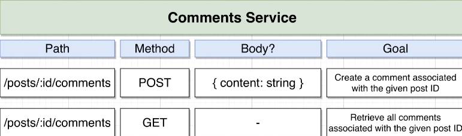
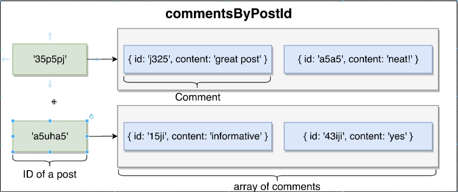

## Comments service
Creates a comment and list all comments

we have a single route that creates new comments `app.post` and another route `app.get` that retrives comments  

comment architecture:  

## running 
`npm i`  
`npm start`

## Testing
send request via [Postman](https://www.postman.com/postman/workspace/postman-api-monitoring-examples/request/create?requestId=d3a41737-f715-48a8-97fe-373a9cf564a4) to the server endpoint `localhost:4001/posts/<id>/comments`

### trouble shooting
check running server instances linux `lsof -nP -iTCP -sTCP:LISTEN`  
kill running server instance `kill -9 <PID>`

