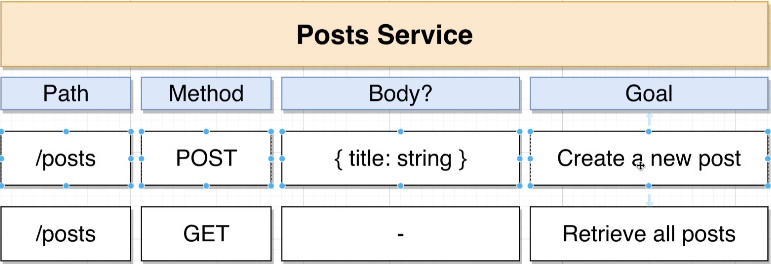

## posts service
Creates a post and list all posts

we have a single route that creates new posts `app.post` and another route `app.get` that retrives all posts  

## running 
`npm i`  
`npm start`

## Testing
send request via [Postman](https://www.postman.com/postman/workspace/postman-api-monitoring-examples/request/create?requestId=d3a41737-f715-48a8-97fe-373a9cf564a4) to the server endpoint `localhost:4000/posts`

### trouble shooting
check running server instances linux `lsof -nP -iTCP -sTCP:LISTEN`  
kill running server instance `kill -9 <PID>`

